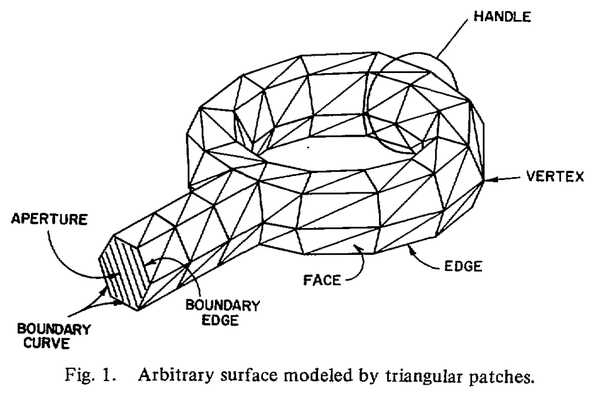
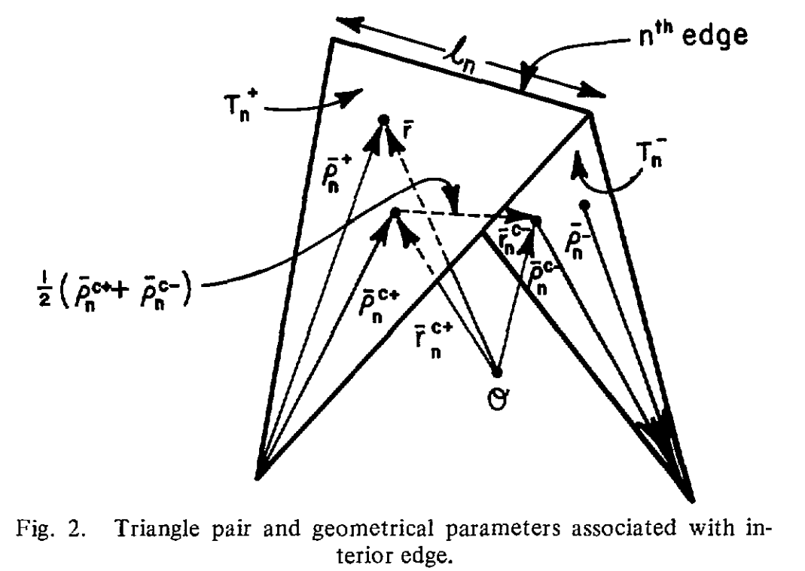

# Glimmer 

```
Alex Laut
Bridge 12
May 30 25
```

## Physical Optics

Fields radiated from an aperture can be summaried with the Stratton-Chu equations

 
$$E = \oint_S   ((n \times E) \times \nabla G + i k \eta (n \times H) G + (n  \cdot E) \nabla G  ) dS$$

$$H = \oint ((n \times H) \times \nabla G - \frac{i k}{\eta} (n \times E) G + (n \cdot H) \nabla G ) dS$$

where

$$G = \frac{e^{i k R}}{4 \pi R} \quad R = |r-r'| \quad \nabla ' G = \frac{r}{R}G(\frac{1}{R} - jk)$$
 
Reflected fields are given by

$$E = 2(E\cdot n)n - E$$
$$H = H - 2(H\cdot n)n$$

## EFIE MoM RWG Solver
PEC scattering is described by

$$n \times (E - j \omega A - \nabla \phi) = 0$$

where

$$A = \mu \oint JGdS \quad \phi = \frac{1}{\epsilon}\oint\sigma GdS \qquad  \quad \nabla \cdot J = -j \omega \sigma $$

and

$$G = \frac{e^{-i k R}}{4\pi R} \qquad R = |r-r'|$$
letting

$$\omega\epsilon = \frac{k}{\eta} \quad \omega \mu = \eta k$$

we yield the following simplified EFIE equation

$$\boxed{n \times E = n \times i k \eta \oint (JG + \frac{1}{k^2}(\nabla'\cdot J) \nabla G)dS'}$$

Presume we are dealing with arbitrary surfaces modeled by triangular patches

<!--  -->

we can then develop a basis function associated to each interior edge that vanishes everwhere on S except within the two triangles attached to that edge

<!--  -->

Let

$$\rho_n^\pm = r - r_n^\pm$$

The vector basis is defined as

$$f_n^\pm(r) =  \pm \frac{l_n}{2A_n^\pm}\rho_n^\pm \mid r \in T_n^\pm $$

The surface divergence is given by

$$\nabla \cdot f_n^\pm(r) = \pm\frac{l_n}{A_n^\pm} \mid r\in T_n^\pm$$

The currents are therefore approximated by summing current contributions over the edge basis n

$$J(r) \approx \sum_{n=1}^N I_nf_n(r)$$

The goal is then to solve the following

$$ZI = V$$

where

$$Z = l [\frac{j \omega}{2} (A^+\cdot \rho^+ + A^-\cdot \rho^-) + \phi^- - \phi^+]$$

where

$$V = \frac{l}{2}(E^+\cdot \rho^+ + E^-\cdot\rho^-)$$

$$A = \mu \oint f_n(r')G(R_m^\pm)dS'$$


$$\phi = \frac{j}{\omega\epsilon}\oint\nabla'\cdot f_n(r') G(R_m^\pm)dS'$$

$$R_m^\pm = |r_m^{c\pm}-r'|$$

# EFIE Equations

The scattered electric field can be computed from the surface current by

$$E(r) = -j\omega A(r) - \nabla \phi(r)$$

with magnetic vector potential given by 
$$A(r) = \mu \int J(r') G(r, r') dS'$$

and scalar potential given by 

$$\phi(r) = \frac{1}{\epsilon}\int \sigma(r') G(r, r') dS'$$

where the green's function is defined by

$$G(r, r') = \frac{e^{-jkR}}{4\pi R}$$

displacement vector by

$$R = |r-r'|$$

and surface charge density defined by continuity equation

$$\nabla\cdot J = -j\omega \sigma$$

expaning the potential term gives us

$$\nabla \phi(r) = \frac{j}{\omega\epsilon}\oint\nabla'\cdot J(r') \nabla G(r,r') dS'$$

where

$$\nabla G(r, r') =  -G(r,r') (1+ j k R)\frac{r-r'}{R}$$

# References

1. S. Rao, D. Wilton, and A. Glisson, “Electromagnetic scattering by surfaces of arbitrary shape,” IEEE Trans. Antennas Propagat., vol. 30, no. 3, pp. 409–418, May 1982, doi: 10.1109/TAP.1982.1142818.
2. C. J. Bouwkamp, “Diffraction Theory,” Rep. Prog. Phys., vol. 17, no. 1, pp. 35–100, Jan. 1954, doi: 10.1088/0034-4885/17/1/302.
3. P. Rabinowitz and N. Richter, “Perfectly Symmetric Two-Dimensional Integration Formulas with Minimal Numbers of Points,” Mathematics of Computation, vol. 23, no. 108, p. 765, Oct. 1969, doi: 10.2307/2004962.


<!-- 
# from the paper

$$\mathbf{f}_n(\mathbf{r}) = \begin{cases} \frac{l_n}{2A_n^+} \rho_n^+, & \mathbf{r} \in T_n^+ \\ -\frac{l_n}{2A_n^-} \rho_n^-, & \mathbf{r} \in T_n^- \\ 0, & \text{otherwise} \end{cases}$$

$$\nabla_s \cdot \mathbf{f}_n = \begin{cases} \frac{l_n}{A_n^+}, & \mathbf{r} \in T_n^+ \\ -\frac{l_n}{A_n^-}, & \mathbf{r} \in T_n^- \\ 0, & \text{otherwise} \end{cases}$$

$$ \mathbf{J} \approx \sum_{n=1}^{N} I_n \mathbf{f}_n(\mathbf{r}) $$

$$Z_{mn} = l_m \left[ j\omega \left( \mathbf{A}_{mn}^+ \cdot \frac{\rho_m^{c+}}{2} + \mathbf{A}_{mn}^- \cdot \frac{\rho_m^{c-}}{2} \right) + (\Phi_{mn}^- - \Phi_{mn}^+) \right]$$

$$V_m = l_m \left( \mathbf{E}_m^+ \cdot \frac{\rho_m^{c+}}{2} + \mathbf{E}_m^- \cdot \frac{\rho_m^{c-}}{2} \right)$$

$$\mathbf{A}_{mn}^\pm = \frac{\mu}{4\pi} \int_S \mathbf{f}_n(\mathbf{r}') \frac{e^{-jk R_m^\pm}}{R_m^\pm} \, dS'$$

$$\Phi_{mn}^\pm = -\frac{1}{4\pi j \omega \epsilon} \int_S \nabla_s' \cdot \mathbf{f}_n(\mathbf{r}') \frac{e^{-jk R_m^\pm}}{R_m^\pm} \, dS'$$

$$R_m^\pm = |\mathbf{r}_m^{c\pm} - \mathbf{r}'|$$

$$\mathbf{E}_m^\pm = \mathbf{E}^i(\mathbf{r}_m^{c\pm})$$


# the next section
 

$$\rho_i = \pm (\mathbf{r}' - \mathbf{r}_i), \quad i = 1, 2, 3$$

$$\mathbf{A}_{pq} = \frac{\mu l_i}{4\pi} \int_{T_q} \left( \frac{l_i}{2A_q} \right) \rho_i \cdot \frac{e^{-jk R^P}}{R^P} \, dS'$$

$$\Phi_{pq} = -\frac{1}{4\pi j \omega \epsilon} \int_{T_q} \left( \frac{l_i}{A_q} \right) \frac{e^{-jk R^P}}{R^P} \, dS'$$

$$R^P = |\mathbf{r}^{cP} - \mathbf{r}'|$$

$$s = \frac{A_1}{A}, \quad \eta = \frac{A_2}{A}, \quad \xi = \frac{A_3}{A}$$

$$\xi + \eta + \xi = 1$$

$$\mathbf{r}' = \xi \mathbf{r}_1 + \eta \mathbf{r}_2 + \xi \mathbf{r}_3$$

$$\mathbf{A}_{pq} = \pm \frac{\mu l_i}{4\pi} (\mathbf{r}_1 I_{\xi}^{pq} + \mathbf{r}_2 I_{\eta}^{pq} + \mathbf{r}_3 I_{\xi}^{pq} - \mathbf{r}' I_{pq})$$

$$\Phi_{pq} = \pm \frac{l_i}{j 2\pi \omega \epsilon} I_{pq}$$

$$I_{pq} = \int_0^1 \int_0^{1-\eta} \frac{e^{-jk R^P}}{R^P} \, d\xi \, d\eta$$

$$I_{\xi}^{pq} = \int_0^1 \int_0^{1-\eta} \xi \frac{e^{-jk R^P}}{R^P} \, d\xi \, d\eta$$

$$I_{\eta}^{pq} = \int_0^1 \int_0^{1-\eta} \eta \frac{e^{-jk R^P}}{R^P} \, d\xi \, d\eta$$

$$I_{\xi}^{pq} = I_{pq} - I_{\xi}^{pq} - I_{\eta}^{pq}$$

$$\xi + \eta + \zeta = 1$$

$$\mathbf{r}' = \xi \mathbf{r}_1 + \eta \mathbf{r}_2 + \xi \mathbf{r}_3$$

## RWG Basis

$$f_n(r) = \pm \frac{l_n}{2A_n^\pm}(r-r_n^\pm) \qquad r \in T_m^\pm$$

$$\nabla \cdot f_n(r) = \pm \frac{l_n}{A_n^\pm} \qquad r \in T_m^\pm$$

## Equations


$$Z_{mm} = E_m [ j\omega ( A^+_{mn} * c^+_m / 2 + A^-_{mn} * c^-_m / 2 ) + \phi^+_{mn} - \phi^-_{mn} ]$$

$$V_m = E_m ( E^+_{mn} * c^+_m / 2 + E^-_{mn} * c^-_m / 2 )$$

$$A^+_{mn} = (\mu / 4\pi) \int_S F_n(r') e^{-j k R^+_m} dS'$$

$$\phi^+_{mn} = - (1 / 4\pi j \omega \varepsilon) \int_S \nabla'_s * F_n(r') e^{-j k R^+_m} dS'$$

$$R^+_m = | r^+_m - r' |$$

```
        if False:
            # rp = rc + (r[:, 0] - rc)/10
            # self.rp = self.rc + (self.r[0] - self.rc) / 10
            # rp = rc[:, None, :] + (r - rc[:, None, :]) / 10
            # self.rp = self.rc + self.rhomc[0]/2
            # self.rp = (self.rc + self.r) / 2

            rp = np.stack([
                rc + (r[:, 0] - rc)/10,
                rc + (r[:, 1] - rc)/10,
                rc + (r[:, 2] - rc)/10])

            dSp = np.stack([dSp / 3, dSp / 3, dSp / 3])
            ind = np.stack([ind, ind, ind], axis=-2)

            # reshape to maintain dimensionality of integration points
            rp = rp.reshape(-1, 3, order="F")
            dSp = dSp.reshape(-1, order="F")
            ind = ind.reshape(ind.shape[0], ind.shape[1], -1, order="F")
``` -->

<!-- # singular equations

The potential matrices are defined by the following integrals

$$A_{mn}^\pm = \mu \oint f_n(r')  G_m(r_m^{c\pm}, r')dS'$$
$$\phi_{mn}^\pm = \frac{j}{\omega \epsilon} \oint \nabla'\cdot f_n(r')G_m(r_m^{c\pm}, r')dS'$$

where:

$$G_m(r_m^{c\pm}, r') = \frac{e^{-i k R_m^\pm}}{R_m^\pm} \qquad R_m^\pm = |r_m^{c\pm} - r'|$$

and

$$f_n(r') = \pm \frac{l_n}{2A_n^\pm}( r'-r_n^\pm) \qquad \nabla'\cdot f_n(r') = \pm \frac{l_n}{A_n^\pm} \qquad r' \in T_n^\pm$$

Let $S_1$ define a singular subdomain of $S$ where $r'\neq r_m^{c\pm}$ and $S_2$ define the subdomain where $r' = r_m^{c\pm}$, we can divide up the integrals as follows

$$A = \mu \oint_{S_1} f_n G_m dS' + \oint_{S_2}f_n G_m dS'$$

We can begin to extract the singular component over $S_2$ by expanding as follows

$$\begin{aligned}
    \oint_{S_2}f_n G_m dS' &= \oint_{S_2}f_n \left(\frac{e^{-ikR_m}-1}{R_m} + \frac{1}{R_m}\right)dS'\\
    &= \oint_{S_2}f_n\frac{e^{-ikR_m}-1}{R_m}dS' + \oint_{S_2}f_n\frac{dS'}{R_m}\\
    &= \oint_{S_2}f_n(-ik)dS' +\oint_{S_2} \pm \frac{l_n}{2A_n^\pm }(r'-r_n^{c\pm})\frac{dS'}{R_m}
\end{aligned}$$
 
over $S_2$ we can extract the singular part by

The singular integrals can be transformed as follows

$$
\int_T \frac{e^{-jkR}}{R} \, dS' = \int_T \frac{e^{-jkR} - 1}{R} \, dS' + \int_T \frac{dS'}{R}
$$

and

$$\begin{aligned}
    \int_T (\rho' - \rho_m) \frac{e^{-jkR}}{R} \, dS' \\
    &= \int_T (\rho' - \rho) \frac{e^{-jkR}}{R} \, dS' + (\rho - \rho_m) \int_T \frac{e^{-jkR}}{R} \, dS'\\
&= \int_T (\rho' - \rho) \frac{e^{-jkR} - 1}{R} \, dS' + (\rho - \rho_m) \int_T \frac{e^{-jkR} - 1}{R} \, dS' \\
&+ \int_T \frac{\rho' - \rho}{R} \, dS' + (\rho - \rho_m) \int_T \frac{dS'}{R}

\end{aligned}$$ -->